# 强化学习课件摘要

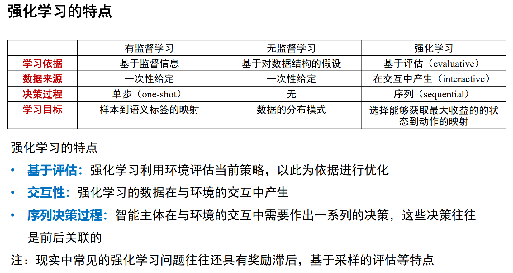

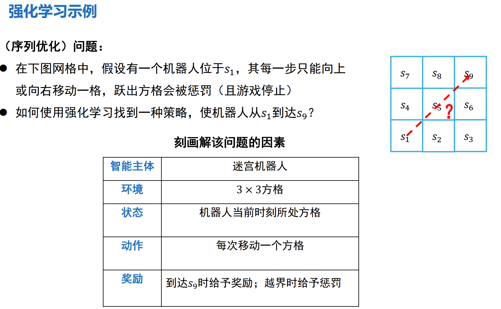

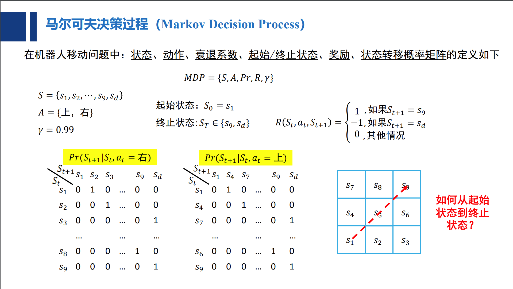

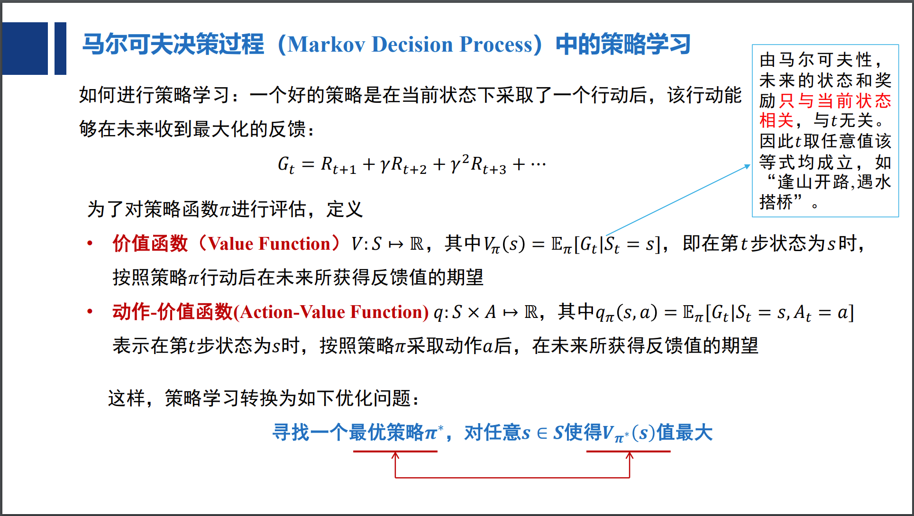

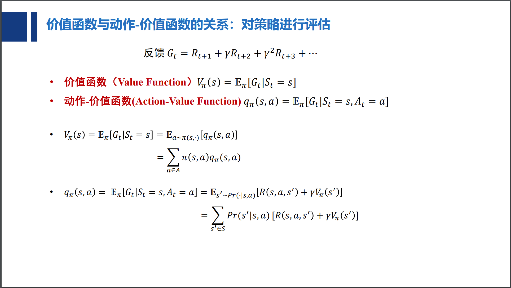

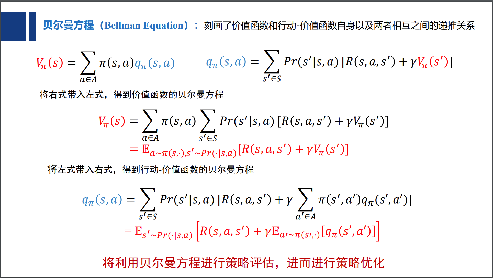

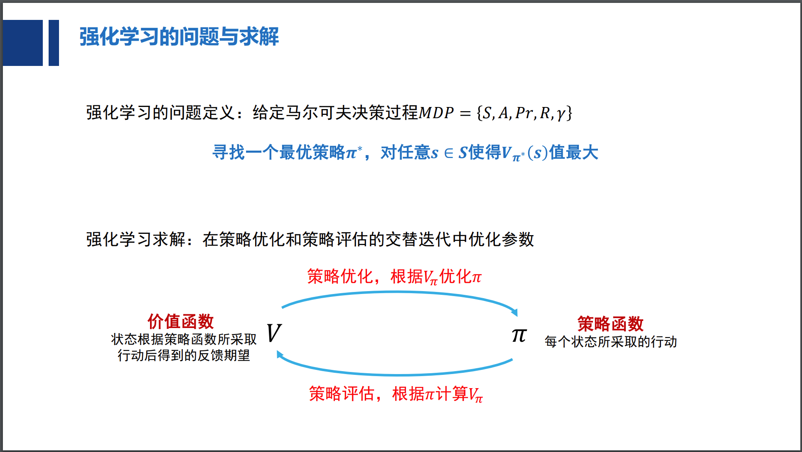

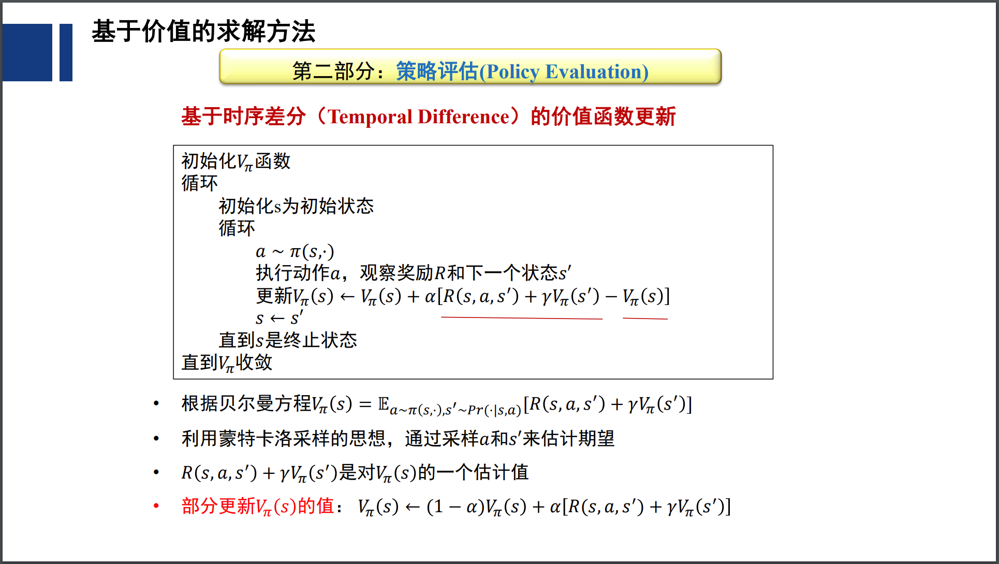

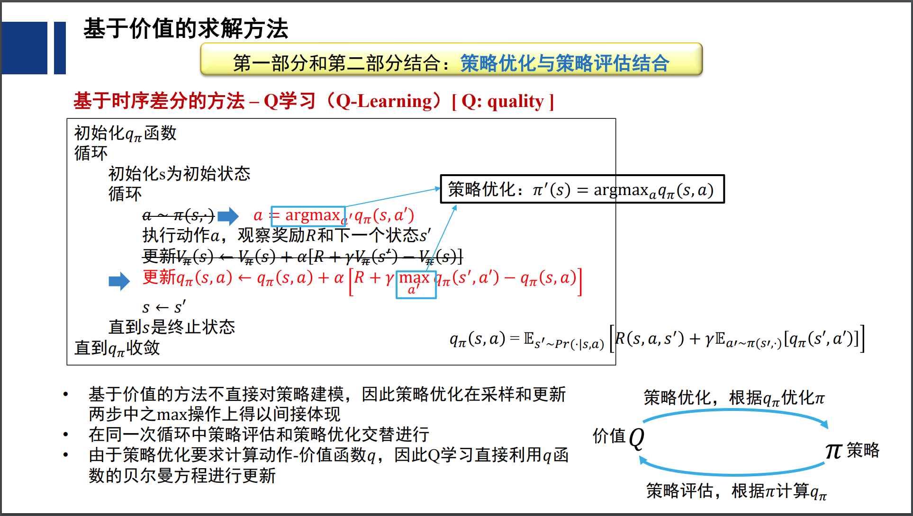

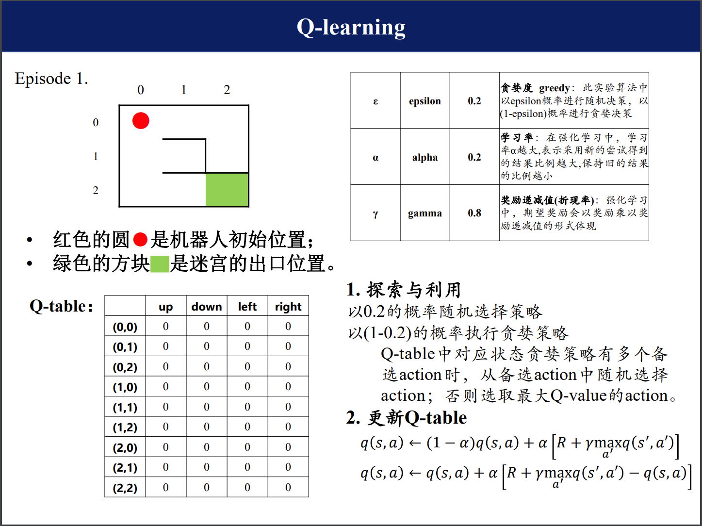

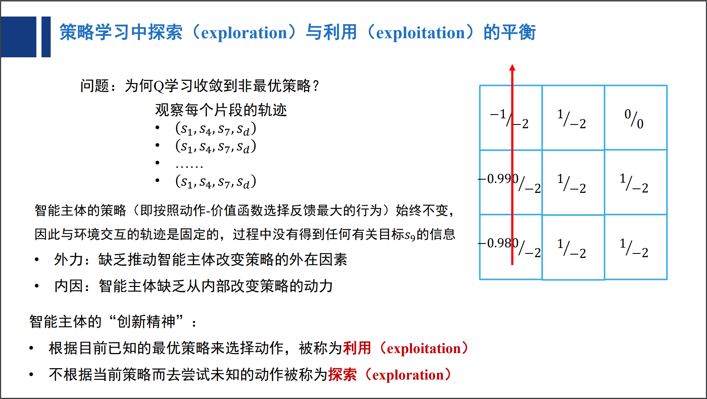

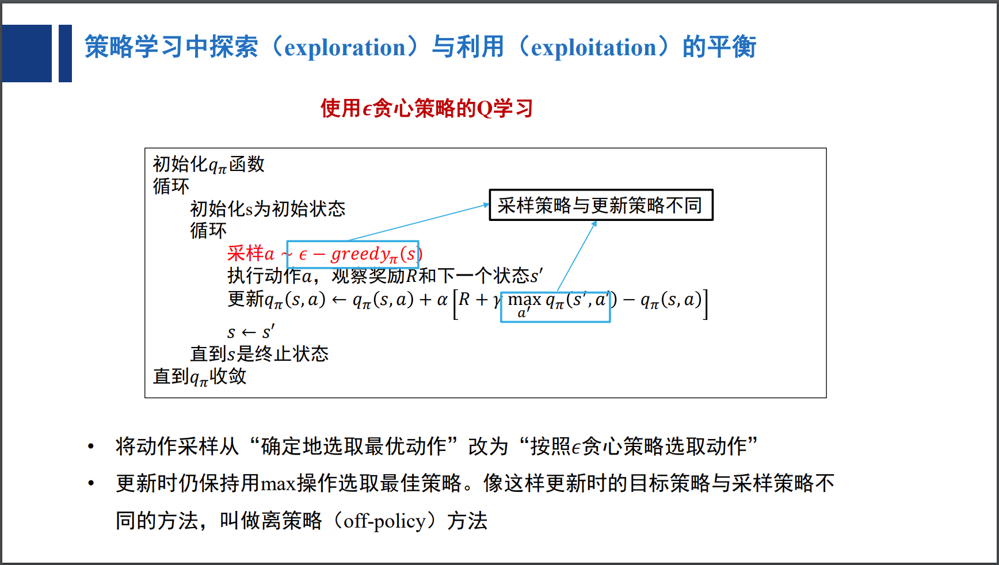

# 参考资料

- 强化学习入门MDP：https://zhuanlan.zhihu.com/p/25498081
- QLearning 示例：http://mnemstudio.org/path-finding-q-learning-tutorial.htm
- QLearning 知乎解释：https://www.zhihu.com/question/26408259
- DeepQLearning 论文：[https://files.momodel.cn/Playing%20Atari%20with%20Deep%20Reinforcement%20Learning.pdf](https://files.momodel.cn/Playing Atari with Deep Reinforcement Learning.pdf)

# 要点记录

## 马尔科夫过程

## 马尔可夫决策过程

马尔科夫决策过程由元组![[公式]](https://www.zhihu.com/equation?tex=%5Cleft%28S%2CA%2CP%2CR%2C%5Cgamma%5Cright%29)描述，其中：![[公式]](https://www.zhihu.com/equation?tex=S)为有限的状态集, ![[公式]](https://www.zhihu.com/equation?tex=A) 为有限的动作集, ![[公式]](https://www.zhihu.com/equation?tex=P) 为状态转移概率, ![[公式]](https://www.zhihu.com/equation?tex=R)为回报函数, ![[公式]](https://www.zhihu.com/equation?tex=%5Cgamma+) 为折扣因子，用来计算累积回报。注意，跟马尔科夫过程不同的是，马尔科夫决策过程的状态转移概率是包含动作的即：![[公式]](https://www.zhihu.com/equation?tex=P_%7Bss%27%7D%5E%7Ba%7D%3DP%5Cleft%5BS_%7Bt%2B1%7D%3Ds%27%7CS_t%3Ds%2CA_t%3Da%5Cright%5D)
