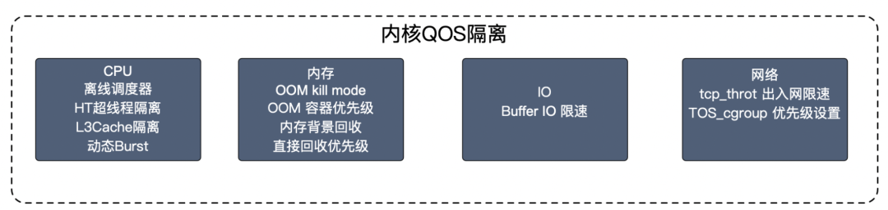

# 参考文献

## 深入理解百度在离线混部技术

（https://developer.baidu.com/article/detail.html?id=294741)

服务器资源利用率较低，TCO(IT 基础设施的总拥有成本) 逐年上涨，对于拥有大量机器资源的公司来说无疑是一个头疼的问题。混部技术就是在这种情况下应运而生，目前，混部技术在业界还属于比较小众的领域，只有一些资源量级较大的公司在研究、发展混部技术，以期获得收益。

对于百度而言，通过应用混部技术，主混部集群数十万台，提升 CPU 利用率到 40+%，累计节约了数十亿人民币。目前百度容器引擎产品 CCE 已支持在离线混部，并完成了大规模业务落地，本文将带大家深入了解百度的在离线混部技术。

在线和离线业务如何划分？在百度内部，我们认为在线业务特点包括但不限于：运行时间长，延时敏感，对稳定向要求较高，服务不稳定业务会立马感知并且带来损失，有明显的波峰波谷，白天高，深夜低，比如广告搜索业务；而离线业务的特点包括但不限于非延时敏感，可重试，运行时间一般较短在几十分钟左右，内部一般为大数据计算，机器学习等服务。
在线业务以搜索为例，白天用户工作学习时查询量会非常大，但是当大部分用户夜间休息时，查询量相对白天就会变得非常小，此时我们就可以引入离线业务。离线业务没有严格的时间要求，随时都能跑，用户关心的是任务能不能跑完，对于什么时候跑完并没有太大的需求，同时如果单机上资源有冲突，此时我们会压制离线业务，甚至会驱逐离线业务，这对用户是无感的，计算平台重新拉起任务，继续计算。
因此，在线型业务和离线业务具备资源互补的特点，从时间上和对资源的容忍度上可以完美的结合到一起。一方面，在线业务的优先级更高，单机和调度层面会优先保障在线的资源，可能会对离线进行压制和驱逐，另一方面，对于离线任务来说，压制和驱逐对用户是无感的，只需要保证任务顺利完成，有很高的容忍度。
**简单来说，将在线业务和离线任务混合混部到相同物理资源上，通过资源隔离、调度等控制手段 , 充分使用资源，同时保证服务的稳定性，我们称这样的技术为“混部”。**

针对 Kubernetes 无法根据资源使用量分配资源，我们引入了动态资源视图。
在混部调度中，在线和离线使用相同的物理资源，在线看到的资源视图和离线看到的资源视图相互独立。在线业务看到的可用资源依旧为整机资源进行静态分配，离线看到的可用资源为整机资源减去在线作业已经使用的资源。

**资源类型：**

1. 可压缩资源：CPU、IO带宽、网络带宽
2. 不可压缩资源：内存、磁盘容量

**资源隔离：**

由于在离线混部是将在线业务和离线任务混合混部到相同物理资源上，所以在离线业务由于流量激增，出现资源争抢时，如何保证在线的 SLA 不受影响，并且在保证在线服务的 SLA 时，也要保证离线任务的整体质量，保证离线作业的成功率和耗时。

- cpuset编排：绑定核心，且numa感知

- 离线调度器：是一种离线任务专用的 CPU 调度算法，从调度器上分开，在线调度器看不到离线任务。在线调度器先于离线调度器进行任务调度，存在在线任务时，离线得不到调度。所以对于在线任务来说，可以达到混部前相近的 CPU 质量。
- **page cache要不要主动回收的解释：**看要内存密集型还是读IO密集型。1）容器的 page cache 得不到回收，它依赖于容器管理 page cache 的机制是需要才去回收的方式，即没有后台回收，每次都是分配时候发现到达 limit 了，在 alloc 的时候出发回收，如果业务压力较大，分配的速度大于回收的速度，就可能出现 OOM 的问题。2）cache 回收时并不会区分在线离线业务，会导致在线业务的 cache 可能会被先于离线 cache 回收掉，如果在线有大量的读 cache 行为，会造成 cache 命中降低，直接进行读盘操作，会导致在线业务的性能下降，甚至会导致 IO 夯住。
- 内存背景回收：异步回收 cache，根据在线离线的 QOS 不同，设置不同的背景回收水位，优先回收离线业务的 cache。
- 基于ebpf的定制隔离策略：现有的内核隔离策略都是基于 QOS，创建容器时进行 cgroup 配置，由内核进行统一的资源管理，但是某些高敏业务在最高优先级的 QOS 下也无法保证其特定资源，或者需要某一纬度的资源需要高优保证，此时通用隔离策略无法满足。
- 单机资源管理：在混部时，离线可以占用多少资源一直是一个问题。机型不同，在线服务的敏感度不同，离线业务占用的资源多少对在线造成的影响也不尽相同，针对这种情况，我们对集群纬度，池 (具有相同特性的一批机器) 纬度，节点纬度对离线可用资源上限做了限制，其中粒度最小优先级最高。



**高性能调度器：**在线和离线业务的调度需求是不一样的，在线一般为常驻服务，不会频繁变更，对调度器要求较低。但是离线任务由于具有运行时间短 (几分钟到几小时)，任务多的特点，以 Kubernetes 默认调度器的调度性能不足以支撑离线任务的调度。所以我们开发了高性能的离线调度器，计算可以达到 5000 ops。为了防止调度速度过快，对 ETCD 和整个集群造成压力，我们限制了 binding 速度为 1500 ops。

**资源画像**
单机资源隔离是针对已经调度到节点上的任务进行隔离，如果检测到离线任务对在线产生一定的影响后，会很快响应对离线任务进行压制和驱逐的操作。这样会影响离线任务的稳定性。针对这种场景，如果在调度时可以预测到节点上未来一段时间的在线使用量，可以针对性的调度离线任务。

如何提供更稳定的超发资源，则取决于我们资源预测的准确度是什么样的。不仅离线调度需要资源画像，在线调度也需要资源画像，通过资源画像可以有效的避免热点产生。

未来，从在离线混部，走向无差别混部。

## 一文看懂业界在离线混部技术

(https://www.infoq.cn/article/knqswz6qrggwmv6axwqu)

> 通过对目前业界在离线方案方案的分析，我们可以抽象出在离线混部方案的三个划分维度：
>
> - 从在离线混部的隔离类型上，可以分为独占内核和共享内核，主要取决于混部的服务内核是否独立。如果服务是混部于同一台物理机上，属于共享内核；如分属于不同物理机，则属于独占内核。
>
> - 从在离线混部的部署底座上，可以分为物理机部署和容器部署。
> - 从在离线混部的调度决策上，可以分为静态决策和动态决策。判断标准是调度决策所依赖的元素是否是运行过程中的实时指标。如是则属于动态决策，反之则属于静态决策。动态决策资源利用率更高，但是要做好突发状况时的资源保障。
>
> 这三个维度的组合，目前实际应用中主要是独占内核 + 物理机 + 静态决策、独占内核 + 容器 + 动态决策、共享内核 + 容器 + 动态决策这三种模式。

# 零碎的想法

1. 虽然paas是通过混部决策系统进行资源分配和调度，但是iaas层还是CPU超分的，那paas层哪怕不混部，是否CPI也会波动，干扰调度？
2. 采用混部技术的k8s集群的宿主机应该采用虚拟机，还是物理机？

